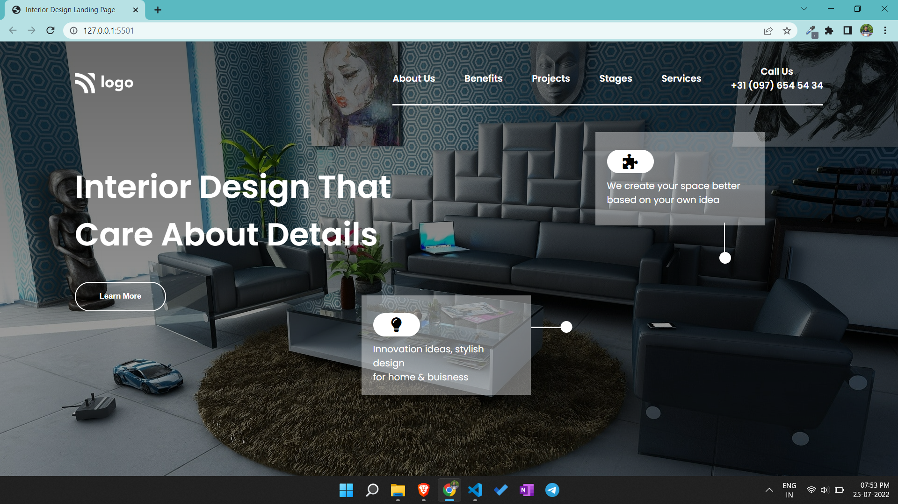

# Portfolio project 10

This is a one page portfolio template project made in HTML and CSS.

# Project live link

[Portfolio-project-10](https://teal-conkies-1e35eb.netlify.app)

# Screenshot

# My learnings from this projects

- I learned to make layouts using flex box.
- I learned to design beautiful buttons and navbar.
- I learned to apply linear gradient to background.

# Time to finish the projecet

I took about 3 hours approximately to complete this project.
